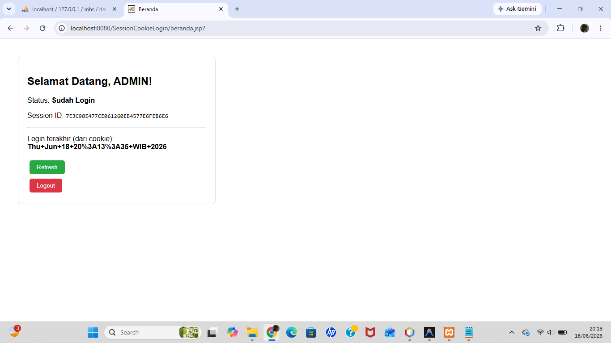

# Pertemuan 10 - Session dan Cookies (JSP)

## Topik
Manajemen state di web: HttpSession (login/logout, atribut session) dan Cookie (simpan data di browser).

## Yang Dibuat
Aplikasi web login sederhana menggunakan JSP. Setelah login, session menyimpan status user. Cookie menyimpan waktu login terakhir yang ditampilkan di halaman berikutnya.

## Lokasi File

```
pertemuan-X/
├── README.md
├── SessionCookie.png
└── SessionCookieLogin/         ← buka project ini di NetBeans
    ├── pom.xml
    └── src/main/webapp/
        ├── index.jsp       ← halaman login
        ├── Validasi.jsp    ← proses login
        ├── beranda.jsp     ← halaman setelah login
        └── Logout.jsp      ← proses logout
```

## Cara Menjalankan
Buka project di NetBeans → klik kanan → Run (deploy ke Tomcat) → buka browser `http://localhost:8080/SessionCookieLogin`

Login: username `ADMIN`, password `ADMIN`

## Screenshot


