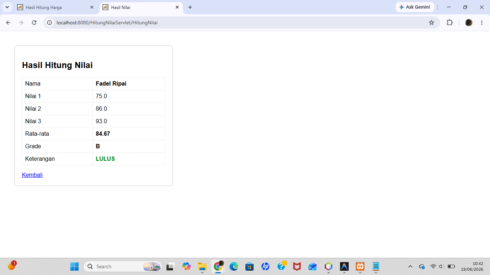
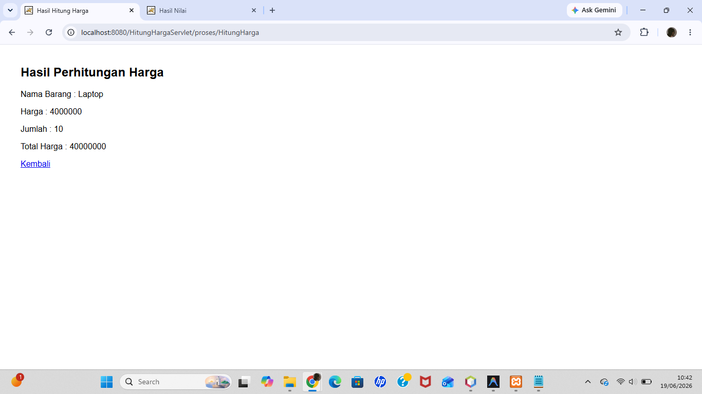

# Pertemuan 11 - Java Servlet

## Topik
Pengenalan Java Servlet: HttpServlet, doGet, doPost, request parameter, response output, dan @WebServlet annotation.

## Yang Dibuat
Dua project servlet terpisah:
1. **HitungNilaiServlet** — form input 3 nilai, servlet menghitung rata-rata dan grade
2. **HitungHargaServlet** — form input nama barang, harga, jumlah, servlet menghitung total

## Lokasi File

```
pertemuan-XI/
├── README.md
├── HitungNilaiServlet.png
├── HitungHargaServlet.png
├── HitungNilaiServlet/         ← project 1
│   ├── pom.xml
│   └── src/main/
│       ├── java/HitungNilai.java
│       └── webapp/index.html
└── HitungHargaServlet/         ← project 2
    ├── pom.xml
    └── src/main/
        ├── java/proses/HitungHarga.java
        └── webapp/index.jsp
```

## Cara Menjalankan
Buka masing-masing project di NetBeans → Run → buka browser sesuai URL yang muncul

## Screenshot

### Hitung Nilai Servlet


### Hitung Harga Servlet

