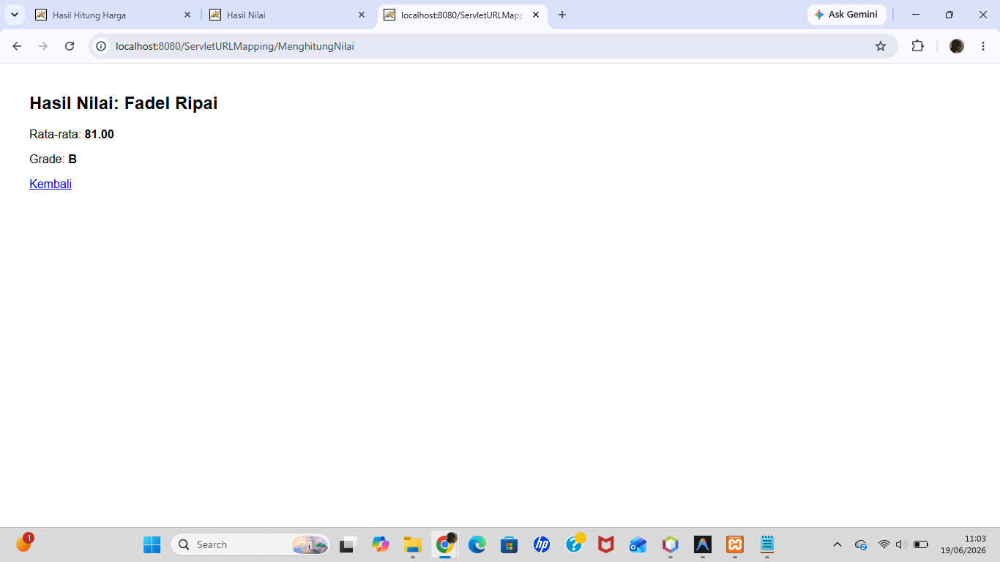

# Pertemuan 12 - Servlet URL Mapping (web.xml)

## Topik
Dua cara mapping URL servlet: via `@WebServlet` annotation dan via `web.xml` (deployment descriptor).

## Yang Dibuat
Project servlet yang mendemonstrasikan konfigurasi URL mapping lewat `web.xml` — servlet `HitungNilai` dipetakan ke URL `/MenghitungNilai` tanpa annotation.

## Lokasi File

```
pertemuan-XII/
├── README.md
├── ServletURL.png
└── ServletURLMapping/          ← buka project ini di NetBeans
    ├── pom.xml
    └── src/main/
        ├── java/HitungNilai.java
        └── webapp/
            ├── index.jsp
            ├── TestJSP.jsp
            └── WEB-INF/web.xml ← konfigurasi URL mapping
```

## Cara Menjalankan
Buka project di NetBeans → Run → buka `http://localhost:8080/ServletURLMapping`

## Screenshot


