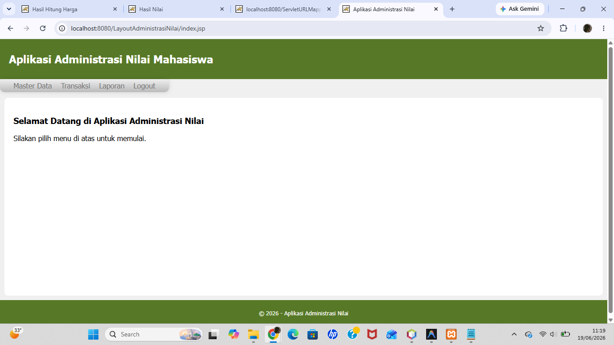

# Pertemuan 13 - Layout JSP dengan CSS (Administrasi Nilai)

## Topik
Desain layout halaman web menggunakan JSP dan CSS: header, navbar dropdown, sidebar, konten, footer.

## Yang Dibuat
Halaman web aplikasi administrasi nilai dengan layout lengkap: header berwarna, navbar dropdown multi-level, area konten, dan footer. Ini adalah tampilan awal (base) sebelum ditambah fitur MVC di Pertemuan 14.

## Lokasi File

```
pertemuan-XIII/
├── README.md
├── Layout.png
└── LayoutAdministrasiNilai/    ← buka project ini di NetBeans
    ├── pom.xml
    └── src/main/webapp/
        ├── index.jsp       ← halaman utama
        ├── style.css       ← CSS layout + navbar dropdown
        ├── DataMhs.jsp
        ├── DataMatkul.jsp
        ├── InputNilai.jsp
        ├── LaporanNilai.jsp
        └── Logout.jsp
```

## Cara Menjalankan
Buka project di NetBeans → Run → buka `http://localhost:8080/LayoutAdministrasiNilai`

## Screenshot


