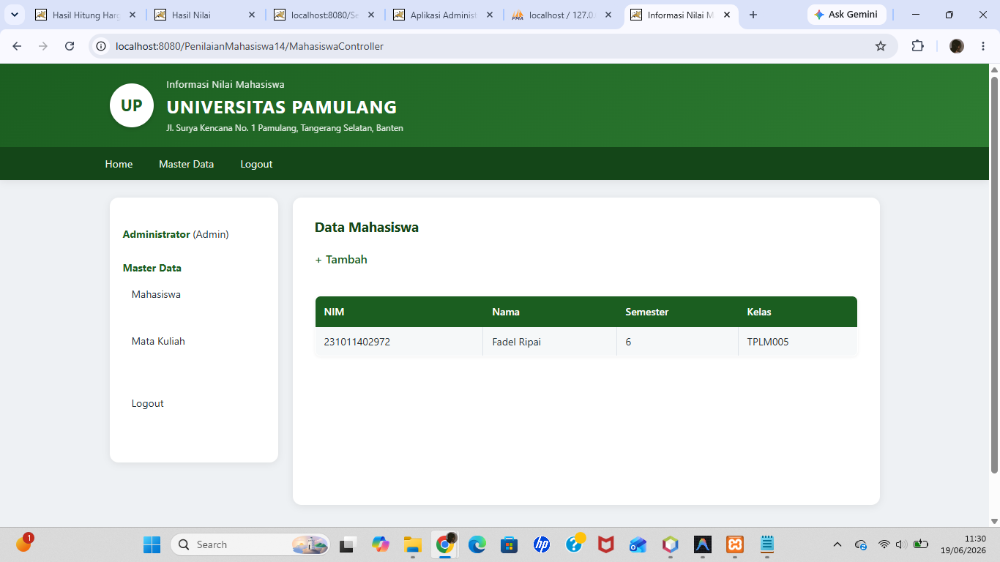

# Pertemuan 14 - Aplikasi Web MVC Base (Master Data)

## Topik
Arsitektur MVC pada aplikasi web Java: package model, view, controller. Login/logout dengan role-based access (admin & mahasiswa). CRUD master data Mahasiswa dan Mata Kuliah.

## Yang Dibuat
Project dasar aplikasi penilaian mahasiswa berbasis web. Fitur: login (admin/mahasiswa), logout, CRUD data mahasiswa, CRUD mata kuliah. Belum ada fitur nilai dan laporan.

## Lokasi File

```
pertemuan-XIV/
├── README.md
├── AplikasiPenilaianMahasiswa.png
└── AplikasiPenilaianMahasiswa/     ← buka project ini di NetBeans
    ├── pom.xml
    ├── database/
    │   └── script_db.sql           ← jalankan di SSMS sebelum run
    └── src/main/java/com/unpam/
        ├── model/
        │   ├── Koneksi.java
        │   ├── Enkripsi.java
        │   ├── Mahasiswa.java
        │   └── MataKuliah.java
        ├── view/
        │   ├── MainForm.java
        │   └── PesanDialog.java
        ├── util/
        │   └── Auth.java
        └── controller/
            ├── LoginController.java
            ├── LogoutController.java
            ├── MahasiswaController.java
            └── MataKuliahController.java
```

## Setup Database
Jalankan `database/script_db.sql` di SSMS. Database `dbaplikasipenilaianmahasiswa`. Login default: `admin` / `admin`.

## Cara Menjalankan
Buka project di NetBeans → Run → buka `http://localhost:8080/PenilaianMahasiswa14`

## Screenshot


