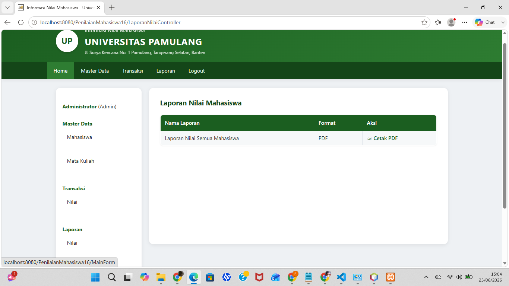
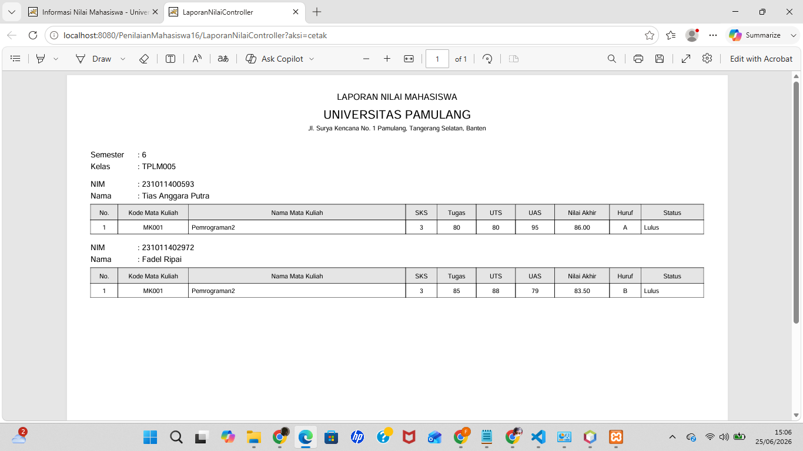

# Pertemuan 16 - Aplikasi Web MVC + Laporan PDF (JasperReports)

## Topik
Integrasi JasperReports pada aplikasi web: kompilasi `.jrxml` di server, export ke PDF, kirim ke browser.

## Yang Dibuat
Project Pertemuan 15 + fitur cetak laporan nilai mahasiswa dalam format PDF menggunakan JasperReports. Laporan ditampilkan langsung di browser (inline PDF).

## Lokasi File

```
pertemuan-XVI/
├── README.md
├── AplikasiPenilaianMahasiswa.png
├── CetakLaporan.png
└── AplikasiPenilaianMahasiswa/     ← buka project ini di NetBeans
    ├── pom.xml
    ├── database/
    │   └── script_db.sql
    └── src/main/
        ├── java/com/unpam/
        │   ├── model/
        │   ├── view/
        │   ├── util/
        │   └── controller/
        │       ├── ...
        │       └── LaporanNilaiController.java  ← controller baru
        └── webapp/
            └── reports/
                └── NilaiReport.jrxml            ← template laporan
```

## Setup Database
Gunakan database yang sama dengan Pertemuan 15 (`dbaplikasipenilaianmahasiswa`).

## Cara Menjalankan
Buka project di NetBeans → Run → buka `http://localhost:8080/PenilaianMahasiswa16` → menu Laporan → Cetak PDF

## Screenshot

### Tampilan Aplikasi


### Cetak Laporan PDF

