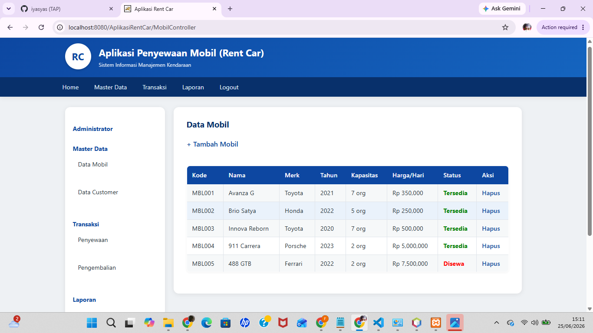
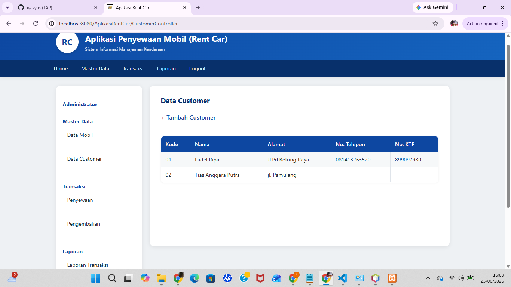
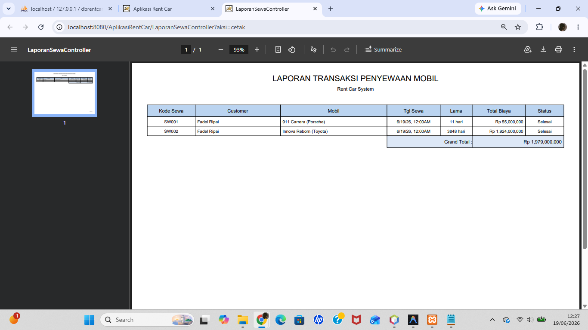
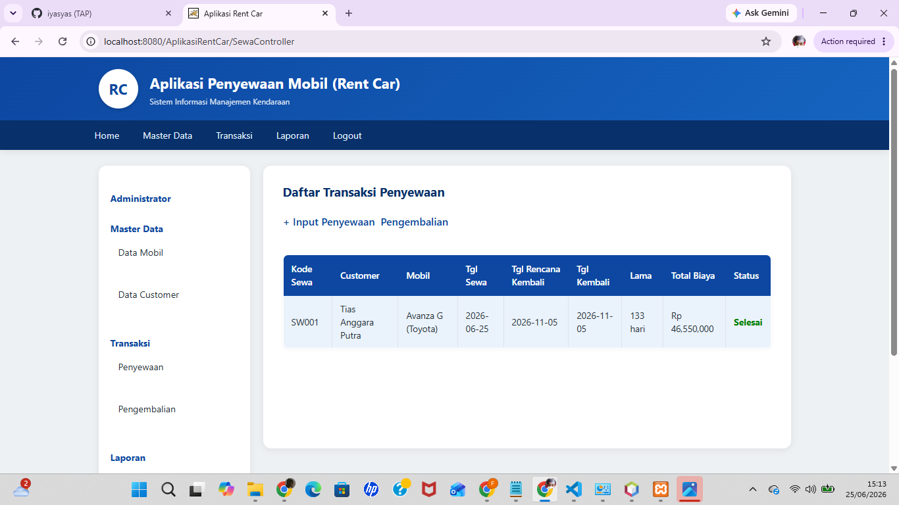

# Pertemuan 17 - Aplikasi Rent Car (Web MVC + SQL Server)

## Topik
Aplikasi web MVC lengkap dengan domain berbeda: sistem penyewaan mobil. Fitur transaksi multi-tabel, auto-generate kode, dan laporan PDF.

## Yang Dibuat
Sistem informasi rent car dengan fitur: master data mobil (CRUD + hapus dengan proteksi FK), master data customer, transaksi penyewaan (kode sewa auto-generate), proses pengembalian mobil, dan laporan transaksi PDF.

## Lokasi File

```
pertemuan-XVII/
├── README.md
├── DataMobil.png
├── DataCustomer.png
├── Cetak.png
├── Laporan.png
└── AplikasiRentCar/            ← buka project ini di NetBeans
    ├── pom.xml
    ├── database/
    │   └── script_db.sql       ← jalankan di SSMS sebelum run
    └── src/main/java/com/rentcar/
        ├── model/
        │   ├── Koneksi.java
        │   ├── Enkripsi.java
        │   ├── Mobil.java
        │   ├── Customer.java
        │   └── Sewa.java
        ├── view/
        │   └── MainForm.java
        ├── util/
        │   └── Auth.java
        └── controller/
            ├── LoginController.java
            ├── LogoutController.java
            ├── MobilController.java
            ├── CustomerController.java
            ├── SewaController.java
            └── LaporanSewaController.java
```

## Setup Database
Jalankan `database/script_db.sql` di SSMS. Database `dbrentcar`. Login default: `admin` / `admin`.

## Cara Menjalankan
Buka project di NetBeans → Run → buka `http://localhost:8080/AplikasiRentCar`

## Screenshot

### Data Mobil


### Data Customer


### Cetak Transaksi


### Laporan

