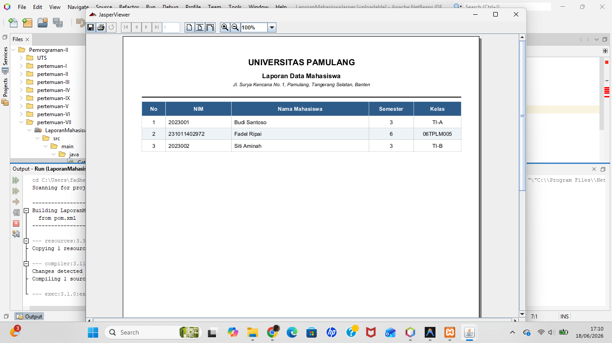

# Pertemuan 7 - Laporan Mahasiswa (JasperReports)

## Topik
Membuat laporan PDF menggunakan JasperReports: kompilasi `.jrxml`, fill data dari database, tampil di JasperViewer.

## Yang Dibuat
Aplikasi desktop dengan tombol "Cetak Laporan" yang menghasilkan laporan data mahasiswa dalam format PDF, ditampilkan di JasperViewer. Layout portrait dengan header, zebra stripe, total, dan nomor halaman.

## Lokasi File

```
pertemuan-VII/
├── README.md
├── LaporanMahasiswaJasper.png
└── LaporanMahasiswaJasper/     ← buka project ini di NetBeans
    ├── pom.xml
    ├── script_db_sqlserver.sql ← jalankan di SSMS sebelum run
    └── src/main/
        ├── java/
        │   └── CetakLaporanForm.java   ← main class
        └── resources/
            └── LaporanMahasiswa.jrxml
```

## Setup Database
Jalankan `script_db_sqlserver.sql` di SSMS. Database `MHS`, tabel `datamhs`.

## Cara Menjalankan
Buka project di NetBeans → Run (F6) → klik "Cetak Laporan"

## Screenshot


