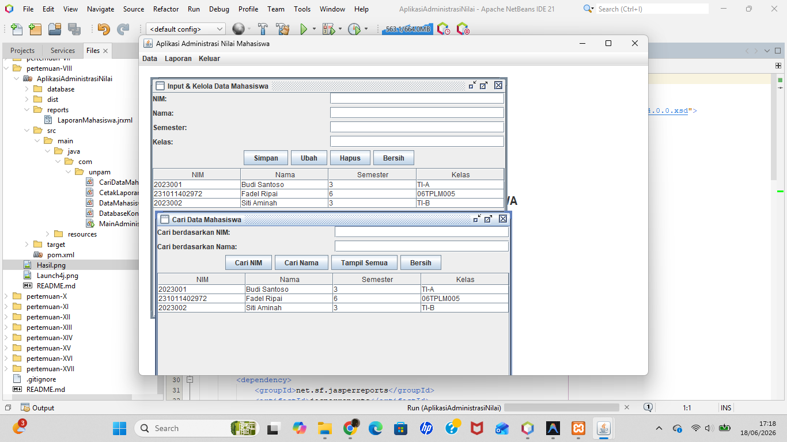

# Pertemuan 8 - Packaging Aplikasi Desktop (Launch4j + NSIS)

## Topik
Mengemas aplikasi Java desktop menjadi file `.exe` menggunakan **Launch4j**, lalu membuat installer menggunakan **NSIS**.

## Aplikasi yang Dikemas
**AplikasiAdministrasiNilai** — aplikasi desktop MDI gabungan dari Pertemuan 5, 6, dan 7:
- Input & kelola data mahasiswa (CRUD)
- Cari data mahasiswa (by NIM / by Nama)
- Cetak laporan mahasiswa (JasperReport → PDF)

Database: SQL Server, database `MHS`, tabel `datamhs`

## Lokasi File

```
pertemuan-VIII/
├── README.md
├── Hasil.png
├── Launch4j.png
└── AplikasiAdministrasiNilai/          ← buka project ini di NetBeans
    ├── pom.xml
    ├── database/
    │   └── script_db.sql               ← jalankan di SSMS sebelum run
    ├── reports/
    │   └── LaporanMahasiswa.jrxml      ← copy ke target/ setelah build
    └── src/main/
        ├── java/com/unpam/
        │   ├── MainAdministrasi.java   ← main class (entry point)
        │   ├── DatabaseKoneksi.java
        │   ├── DataMahasiswaForm.java
        │   ├── CariDataMahasiswaForm.java
        │   └── CetakLaporanForm.java
        └── resources/
            └── LaporanMahasiswa.jrxml
```

Setelah Clean and Build, hasil ada di:
```
target/
├── AplikasiAdministrasiNilai.jar   ← input ke Launch4j
└── lib/                            ← semua dependency JAR
```

File yang sudah di-package tersedia di folder `dist/` (siap dijalankan):
```
dist/
├── AplikasiAdministrasiNilai.jar   ← executable JAR
├── AplikasiAdministrasiNilai.exe   ← hasil Launch4j (setelah packaging)
├── lib/                            ← 19 dependency JAR
└── reports/
    └── LaporanMahasiswa.jrxml      ← template laporan
```

> Untuk menjalankan langsung dari `dist/`: pastikan `lib/` dan `reports/` ada di folder yang sama dengan `.exe`.

## Langkah Packaging

### 1. Build Project
Buka project di NetBeans → klik kanan → **Clean and Build**

### 2. Siapkan folder target
Copy folder `reports/` ke dalam `target/` agar laporan terbaca saat exe dijalankan.

### 3. Launch4j
| Field | Nilai |
|-------|-------|
| Output file | `target\AplikasiAdministrasiNilai.exe` |
| Jar | `target\AplikasiAdministrasiNilai.jar` |
| Change dir | `.` |
| JRE Min version | `1.8.0` |

Klik ikon **gear (⚙)** → Build wrapper

### 4. NSIS
ZIP isi folder `target/` (exe + lib/ + reports/) → buka NSIS → pilih **Installer from ZIP** → generate installer `.exe`

### 5. Test
Install ke folder tujuan → jalankan hasil install → pastikan semua fitur berjalan

## Tools yang Dibutuhkan
- [Launch4j](https://launch4j.sourceforge.net/)
- [NSIS](https://nsis.sourceforge.io/)

## Screenshot

### Tampilan Aplikasi


### Konfigurasi Launch4j

