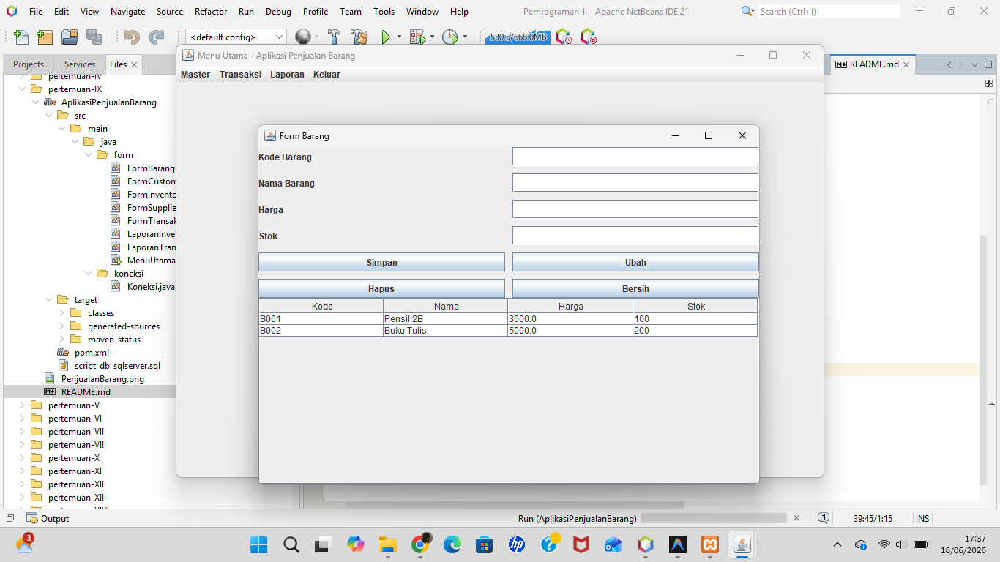

# Pertemuan 9 - Aplikasi Penjualan Barang (Swing + SQL Server)

## Topik
Aplikasi desktop lengkap dengan menu MDI, CRUD multi-tabel, transaksi dengan commit/rollback.

## Yang Dibuat
Sistem penjualan barang dengan fitur: master data (Barang, Customer, Supplier), transaksi penjualan (dengan detail item + update stok otomatis), inventory barang masuk, dan laporan transaksi/inventory.

## Lokasi File

```
pertemuan-IX/
├── README.md
├── PenjualanBarang.png
└── AplikasiPenjualanBarang/    ← buka project ini di NetBeans
    ├── pom.xml
    ├── script_db_sqlserver.sql ← jalankan di SSMS sebelum run
    └── src/main/java/
        ├── koneksi/Koneksi.java
        └── form/
            ├── MenuUtama.java      ← main class
            ├── FormBarang.java
            ├── FormCustomer.java
            ├── FormSupplier.java
            ├── FormTransaksi.java
            ├── FormInventory.java
            ├── LaporanTransaksi.java
            └── LaporanInventory.java
```

## Setup Database
Jalankan `script_db_sqlserver.sql` di SSMS. Database `db_penjualan`.

## Cara Menjalankan
Buka project di NetBeans → Run (F6)

## Screenshot


