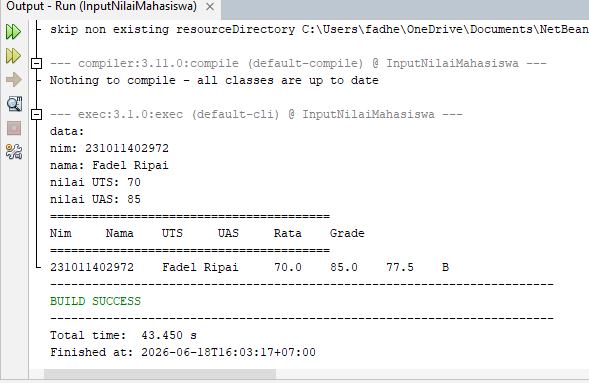

# Pertemuan 1 - Input Nilai Mahasiswa (Console)

## Topik
Pengenalan Java dasar: input/output console, variabel, kondisi, dan penentuan grade.

## Yang Dibuat
Program console untuk menghitung nilai akhir mahasiswa berdasarkan UTS dan UAS, lalu menentukan grade (A-E).

## Lokasi File

```
pertemuan-I/
├── README.md
├── InputNilai.png
└── InputNilaiMahasiswa/        ← buka project ini di NetBeans
    ├── pom.xml
    └── src/main/java/
        └── NilaiMhs.java
```

## Cara Menjalankan
Buka project di NetBeans → Run (F6) → input NIM, Nama, UTS, UAS di console

## Screenshot


