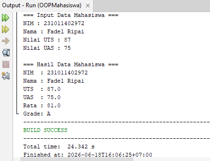

# Pertemuan 2 - OOP Mahasiswa (Console)

## Topik
Pemrograman Berorientasi Objek (OOP): class, object, method, dan encapsulation.

## Yang Dibuat
Refaktor program Pertemuan 1 menggunakan OOP — class `Mahasiswa` dengan method `hitungRata()` dan `tentukanGrade()`.

## Lokasi File

```
pertemuan-II/
├── README.md
├── DataMahasiswa.png
└── OOPMahasiswa/               ← buka project ini di NetBeans
    ├── pom.xml
    └── src/main/java/
        └── MainMahasiswa.java
```

## Cara Menjalankan
Buka project di NetBeans → Run (F6) → input data mahasiswa di console

## Screenshot


