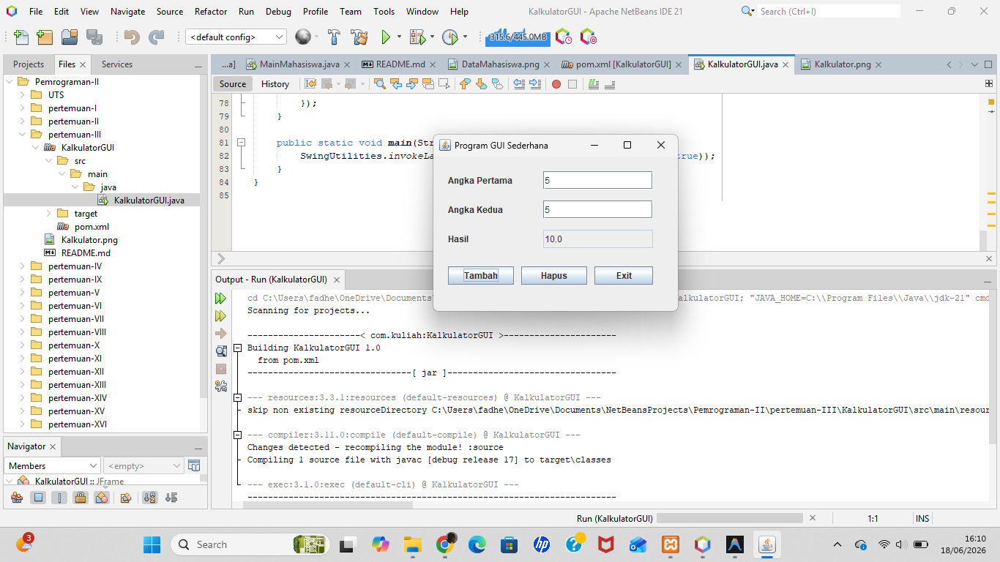

# Pertemuan 3 - Kalkulator GUI (Java Swing)

## Topik
Pengenalan Java Swing: JFrame, JLabel, JTextField, JButton, dan event listener.

## Yang Dibuat
Aplikasi kalkulator sederhana berbasis GUI dengan tombol Tambah, Hapus, dan Exit.

## Lokasi File

```
pertemuan-III/
├── README.md
├── Kalkulator.png
└── KalkulatorGUI/              ← buka project ini di NetBeans
    ├── pom.xml
    └── src/main/java/
        └── KalkulatorGUI.java
```

## Cara Menjalankan
Buka project di NetBeans → Run (F6)

## Screenshot


