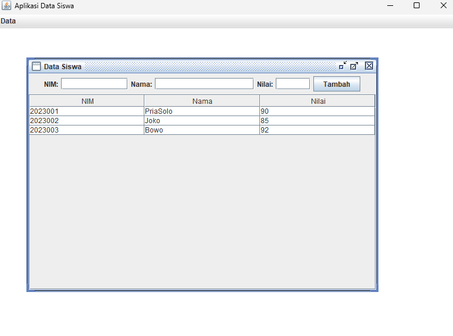

# Pertemuan 4 - Aplikasi MDI Data Siswa (Java Swing)

## Topik
Java Swing lanjutan: JDesktopPane, JInternalFrame, JMenuBar, JTable, dan MDI (Multiple Document Interface).

## Yang Dibuat
Aplikasi MDI dengan menu bar. Menu "Data Siswa" membuka child form berisi tabel data siswa yang bisa diisi manual.

## Lokasi File

```
pertemuan-IV/
├── README.md
├── DataSiswa.png
└── DataSiswaMDI/               ← buka project ini di NetBeans
    ├── pom.xml
    └── src/main/java/
        ├── MenuUtama.java      ← main class
        └── DataSiswaForm.java
```

## Cara Menjalankan
Buka project di NetBeans → Run (F6) → klik menu Data → Data Siswa

## Screenshot


