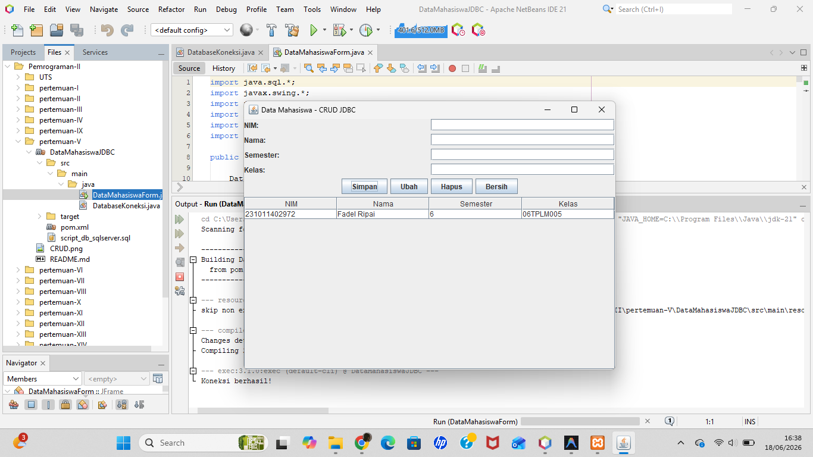

# Pertemuan 5 - CRUD Data Mahasiswa (JDBC + SQL Server)

## Topik
Koneksi database dengan JDBC: INSERT, SELECT, UPDATE, DELETE menggunakan PreparedStatement.

## Yang Dibuat
Aplikasi desktop CRUD data mahasiswa terhubung ke SQL Server. Fitur: Simpan, Ubah, Hapus, Tampil Semua. Klik baris tabel untuk mengisi form edit.

## Lokasi File

```
pertemuan-V/
├── README.md
├── CRUD.png
└── DataMahasiswaJDBC/          ← buka project ini di NetBeans
    ├── pom.xml
    ├── script_db_sqlserver.sql ← jalankan di SSMS sebelum run
    └── src/main/java/
        ├── DataMahasiswaForm.java  ← main class
        └── DatabaseKoneksi.java
```

## Setup Database
Jalankan `script_db_sqlserver.sql` di SSMS. Script membuat database `MHS`, tabel `datamhs`, dan login `app_user`.

## Cara Menjalankan
Buka project di NetBeans → Run (F6)

## Screenshot


