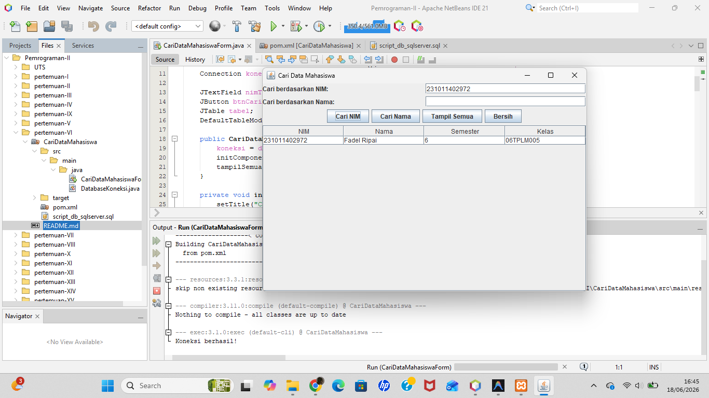

# Pertemuan 6 - Cari Data Mahasiswa (JDBC + SQL Server)

## Topik
Query pencarian dengan JDBC: exact match (WHERE nim = ?) dan partial match (WHERE nama LIKE ?).

## Yang Dibuat
Form pencarian data mahasiswa dengan dua mode: cari by NIM (exact) dan cari by Nama (partial). Menggunakan database yang sama dengan Pertemuan 5.

## Lokasi File

```
pertemuan-VI/
├── README.md
├── CariDataMahasiswa.png
└── CariDataMahasiswa/          ← buka project ini di NetBeans
    ├── pom.xml
    ├── script_db_sqlserver.sql ← jalankan di SSMS (sama dengan P5)
    └── src/main/java/
        ├── CariDataMahasiswaForm.java  ← main class
        └── DatabaseKoneksi.java
```

## Setup Database
Gunakan database `MHS` yang sama dengan Pertemuan 5. Jalankan `script_db_sqlserver.sql` kalau belum ada datanya.

## Cara Menjalankan
Buka project di NetBeans → Run (F6)

## Screenshot


